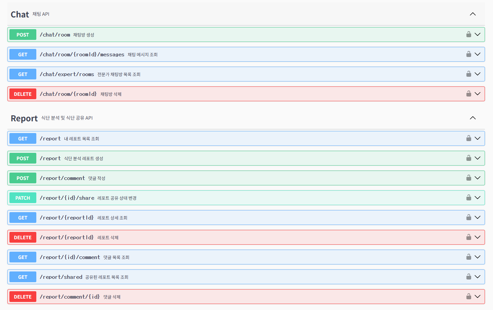
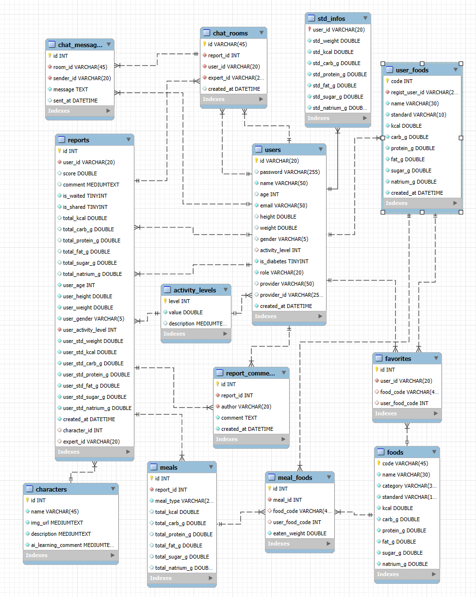

# Foody (푸디) - AI 기반 식단 분석 및 커뮤니티 플랫폼

### 프로젝트 기간
2025.12.01 ~ 2025.12.25

### 팀원
- 박정훈
- 유주경

## 📖 프로젝트 소개
**Foody**는 사용자의 식단을 AI로 분석하여 영양 정보를 제공하고, 이를 기반으로 건강 관리를 돕는 **AI 식단 분석 서비스**입니다.

사용자는 총 세 가지의 방법(DB 음식, 직접 입력, 이미지 분석)을 통해 식단을 등록할 수 있습니다.
Vision-Language Model (VLM)을 활용하여 음식 이미지를 자동 인식하고, 칼로리 및 영양소를 분석합니다. 사용자는 분석된 레포트를 바탕으로 식단을 기록하고, 커뮤니티를 통해 다른 유저들과 식단 정보를 공유할 수 있습니다.

---

## 🏗️ 전체 아키텍처 (Architecture)

Foody는 크게 세 가지의 서버로 구성되어 있습니다.
각 서버의 상세 설정 및 구조는 각 레포지토리의 README를 참고하세요.

### 1. [🧠 Foody-AI (AI 분석 서버)](https://github.com/SSAFY-Foody/Foody-AI)
- **역할**: 음식 이미지 인식 및 식단 분석
- **핵심 기술**: Vision-Language Model (VLM), PyTorch

### 2. [🛡️ Foody-Backend (API 서버)](https://github.com/SSAFY-Foody/Foody-Backend)
- **역할**: 사용자 인증/인가, 데이터 관리(CRUD), 커뮤니티 기능, AI 서버 통신, 데이터베이스 통신
- **핵심 기술**: Spring Boot 3, MyBatis, MySQL, JWT, REST API, WebSocket, OAuth2.0

### 3. [🎨 Foody-Frontend (웹 클라이언트)](https://github.com/SSAFY-Foody/Foody-Frontend)
- **역할**: 사용자 인터페이스(UI), 식단 시각화, 커뮤니티 상호작용
- **핵심 기술**: Vue.js 3, Vite, TypeScript, TailwindCSS, Pinia

---

## ✨ 주요 기능
1.  **📸 AI 음식 이미지 분석**: 음식 이미지를 등록하고 분석 요청을 하면 AI가 음식 종류와 영양소를 자동으로 분석합니다.
2.  **📝 AI 식단 분석**: 식단을 등록하고 분석 요청을 하면 AI가 식단에 대한 분석 결과를 생성합니다.
3.  **📊 영양 리포트**: 섭취한 칼로리, 탄단지 비율을 시각적인 그래프로 제공합니다.
4.  **🤝 식단 커뮤니티**: 나의 식단 리포트를 공유하고, 다른 유저들과 소통(댓글)할 수 있습니다.
5.  **📚 푸디 도감**: 다양한 음식 캐릭터를 수집하고 도감을 채워나가는 재미 요소를 제공합니다.
6.  **🔐 회원 관리**: JWT 기반의 안전한 로그인 및 회원가입, 마이페이지 기능을 제공합니다.

---

## 시작하기 (Getting Started)

프로젝트를 실행하려면 각 모듈별 설정을 완료해야 합니다. 상세 내용은 아래 링크를 확인하세요.

- **Backend 설정 및 실행**: [Foody-Backend README](https://github.com/SSAFY-Foody/Foody-Backend)
- **Frontend 설정 및 실행**: [Foody-Frontend README](https://github.com/SSAFY-Foody/Foody-Frontend)
- **AI 서버 설정 및 실행**: [Foody-AI README](https://github.com/SSAFY-Foody/Foody-AI)

# Foody-Backend

### 핵심 기술
- **Spring Boot**
- **MyBatis**: SQL Mapper Framework
- **MySQL**: RDBMS
- **Spring Security**: 인증/인가
- **JWT**: 인증 토큰 관리
- **OAuth2.0**: 구글, 카카오 인증
- **WebSocket**: 실시간 채팅
- **WebClient**: 외부 API (AI 서버) 통신

---

## ⚙️ 설정 (Configuration)

`application.properties` 파일에 다음 설정을 추가해야 합니다.

### 1. Database 설정
```properties
spring.datasource.url=${DB_URL} # 데이터베이스 URL
spring.datasource.username=${DB_USERNAME} # 데이터베이스 사용자 이름
spring.datasource.password=${DB_PASSWORD} # 데이터베이스 비밀번호
```

### 2. Server URL 설정
```properties
# 프론트엔드 서버
front.server.base.url=${FRONT_SERVER_BASE_URL:http://localhost:5173} # 프론트 서버 베이스 URL (기본 localhost)
front.server.port=${FRONT_SERVER_PORT:5173} # 프론트 서버 포트 (기본 5173번)

# AI 서버 통신
ai.server.base.url=${AI_SERVER_BASE_URL:http://localhost} # AI 서버 베이스 URL (기본 localhost)
ai.vlm.server.port=${AI_VLM_SERVER_PORT:8000} # AI VLM 서버 포트 (기본 8000번)
ai.analysis.server.port=${AI_ANALYSIS_SERVER_PORT:7000} # AI 분석 서버 포트 (기본 7000번)
```

### 3. 외부 API 및 인증 설정
```properties
# Google SMTP
spring.mail.username=${GOOGLE_EMAIL_ID} # 구글 이메일 ID
spring.mail.password=${GOOGLE_APP_PASS} # 구글 앱 비밀번호

# OAuth2 Provider
spring.security.oauth2.client.registration.google.client-id=${GOOGLE_CLIENT_ID} # 구글 클라이언트 ID
spring.security.oauth2.client.registration.google.client-secret=${GOOGLE_CLIENT_SECRET} # 구글 클라이언트 비밀번호
spring.security.oauth2.client.registration.kakao.client-id=${KAKAO_REST_API_KEY} # 카카오 REST API 키
```
---

## 🛠️ 빌드 및 실행 (Build & Run)

### 전제 조건 (Prerequisites)
- Java 17
- Maven

### 실행 방법 (How to Run)
터미널에서 아래 명령어를 실행하여 프로젝트를 빌드하고 실행할 수 있습니다.

```bash
# 프로젝트 클론
git clone https://github.com/SSAFY-Foody/Foody-Backend.git

# 프로젝트 디렉토리로 이동
cd Foody-Backend

# Maven 빌드 및 실행
./mvnw spring-boot:run
```

---

## 📘 API 문서 (API Documentation)
서버가 실행 중일 때, 아래 주소로 접속하여 API 명세를 확인할 수 있습니다.

- **Swagger UI**: [http://localhost:8080/swagger-ui/index.html](http://localhost:8080/swagger-ui/index.html)

- API 문서 (일부)



---

## 📂 패키지 구조 (Package Structure)
```
src/main/java/com/ssafy/foody/
├── admin/         # 관리자 기능
│   ├── controller/    # 관리자 API
│   ├── dto/           # 관리자용 DTO
│   └── service/       # 관리자 비즈니스 로직
│
├── auth/          # 인증/인가 (JWT & OAuth)
│   ├── config/        # Security 설정
│   ├── filter/        # JWT 인증 필터
│   ├── handler/       # 인증 실패/성공 핸들러
│   ├── helper/        # 인증 보조 유틸리티
│   ├── jwt/           # JWT 토큰 생성 및 검증
│   └── oauth/         # OAuth2 사용자 서비스
│
├── character/     # 푸디 도감
│   ├── controller/    # 캐릭터 조회 API
│   ├── domain/        # 캐릭터 엔티티
│   ├── dto/           # 캐릭터 데이터 전송 객체
│   ├── mapper/        # 캐릭터 DB 매퍼
│   └── service/       # 캐릭터 비즈니스 로직
│
├── chat/          # 1:1 상담 채팅
│   ├── controller/    # 채팅방/메시지 API
│   ├── domain/        # 채팅 메시지 엔티티
│   ├── dto/           # 채팅 DTO
│   ├── handler/       # WebSocket 핸들러
│   └── service/       # 채팅 서비스 로직
│
├── common/        # 공통 모듈
│   ├── config/        # 전역 설정 (Swagger, WebMvc 등)
│   ├── dto/           # 공통 응답 DTO (페이지네이션)
│   └── handler/       # 공통 핸들러 (GlobalExceptionHandler)
│
├── email/         # 이메일 서비스
│   ├── controller/    # 이메일 인증 API
│   ├── dto/           # 이메일 요청 DTO
│   └── service/       # SMTP 메일 발송 로직
│
├── food/          # 음식 데이터 관리
│   ├── controller/    # 음식 검색/등록 API
│   ├── domain/        # 음식/찜하기 엔티티
│   ├── dto/           # 음식 관련 DTO
│   ├── mapper/        # 음식 DB 매퍼
│   └── service/       # 음식 관련 서비스
│
├── report/        # 식단 분석 레포트
│   ├── controller/    # 레포트 생성/조회/공유 API
│   ├── domain/        # 레포트/식단 엔티티
│   ├── dto/           # 레포트 관련 DTO
│   ├── helper/        # 레포트 보조 로직
│   ├── mapper/        # 레포트 DB 매퍼
│   └── service/       # 레포트 생성 및 분석 서비스
│
└── user/          # 회원 관리
    ├── controller/    # 회원가입/로그인/마이페이지 API
    ├── domain/        # 사용자 엔티티
    ├── dto/           # 사용자 관련 DTO
    ├── mapper/        # 사용자 DB 매퍼
    └── service/       # 사용자 관리 서비스
```

---

## 🗄️ ER 다이어그램 (ER Diagram)


## 권장 영양소 계산법 (미플린-세인트 지어 공식 참고)

- 표준 몸무게 (변형 브로카 공식 참고)
- 성별에 따른 계산 방식
    - 남성 - (본인 키 - 100) \* 0.9 를 소수점 2자리로 반올림
    - 여성 - (본인 키 - 100) \* 0.85 를 소수점 2자리로 반올림

- 표준 칼로리 섭취량
- 성별에 따른 계산 공식
```math
\text{표준 칼로리 섭취량}(std\_kcal) =
\begin{cases}
\text{남성 =  }(\text{표준 몸무게} \times 10 + \text{본인 키} \times 6.25 - \text{본인 나이} \times 5 + 5) \times \text{활동 계수}\\
\text{여성 =  }(\text{표준 몸무게} \times 10 + \text{본인 키} \times 6.25 - \text{본인 나이} \times 5 - 161) \times \text{활동 계수}\\
\end{cases}
```
- 활동 계수 (해리스-베네딕트 공식 참고)
    - Level 1 => value = 1.2, description = 거의 안함 
    - Level 2 => value = 1.375, description = 가벼운 활동
    - Level 3 => value = 1.55, description = 보통 활동
    - Level 4 => value = 1.725, description = 활발한 활동 
    - Level 5 => value = 1.9, description = 매우 활발 (격렬한 운동, 육체노동)

#### 영양소 비율 - 탄수화물 : 단백질 : 지방 : 당 = 6 : 1.4 : 2.2 : 0.4

```math
    \text{표준 영양소 섭취량}(g) =
    \begin{cases}
    \text{std\_carb\_g(표준 탄수화물 섭취량, 단위 : g) : }\dfrac{\text{표준 칼로리 섭취량} \times 0.6}{4}\\[1em]
    \text{std\_protein\_g(표준 단백질 섭취량, 단위 : g) : }\dfrac{\text{표준 칼로리 섭취량} \times 0.14}{4}\\[1em]
    \text{std\_fat\_g(표준 지방 섭취량, 단위 : g) : }\dfrac{\text{표준 칼로리 섭취량} \times 0.22}{9}\\[1em]
    \text{std\_sugar\_g(표준 당 섭취량, 단위 : g) : }\dfrac{\text{표준 칼로리 섭취량} \times 0.04}{4}\\[1em]
    \text{std\_natrium\_g(표준 나트륨 섭취량, 단위 : g) : }2
    \end{cases}
```
